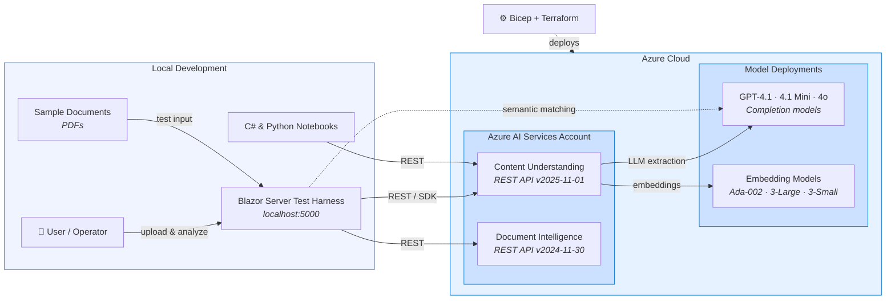
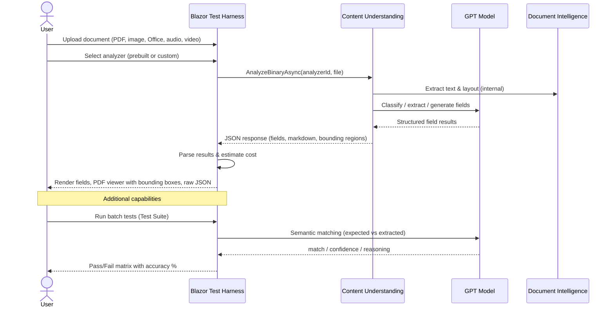

# Azure Content Understanding Workshop

[](https://portal.azure.com/#create/Microsoft.Template/uri/https%3A%2F%2Fraw.githubusercontent.com%2Fharryschaefer93%2Fazure-content-understanding-workshop%2Fmain%2Finfra%2Fbicep%2Fazuredeploy.json)

Accelerator repo for **Azure AI Content Understanding (CU)**. Includes infrastructure-as-code (Bicep + Terraform), a Blazor Server test harness covering 6 use cases, C# and Python notebooks, and synthetic sample documents.

> **Tracking:** See [`MANIFEST.md`](MANIFEST.md) for project status and decisions.

## Solution Architecture

The workshop deploys an **Azure AI Services** account (with optional cross-region models), then connects a local **Blazor Server** test harness that sends documents to Azure for analysis.



> **Authentication:** All access uses Microsoft Entra ID (`DefaultAzureCredential`). API keys are disabled. Each user needs the **Cognitive Services User** role on the AI Services account.
>
> **Infrastructure:** Deployed via Bicep (source of truth) or Terraform. See [`infra/`](infra/) for templates.

## How It Works

The core workflow — uploading a document and getting structured results — follows these steps:



### Workshop Use Cases

| UC | Name | Harness Page | What It Does |
|----|------|--------------|--------------|
| 1 | Schema Generation | `/schema-builder` | Upload samples → auto-detect fields → create custom analyzer |
| 2 | Schema Tuning | `/schema-editor` | Pick a template → customize fields → deploy analyzer |
| 3 | Automated Test Suite | `/test` | Batch-analyze documents → compare against expected values |
| 4 | Natural Language Query | `/analyze` | Upload a document → extract fields or ask NL questions |
| 5 | Multi-Document Validation | `/validate` | Analyze multiple docs → cross-document consistency check |
| 6 | Corrective Feedback | `/feedback` | Edit field descriptions → re-analyze → verify improvement |

## Repository Structure

```
ContentUnderstanding.sln          Solution file

infra/
  bicep/                          Bicep templates (source of truth)
    main.bicep                    Entry point — single or cross-region deployment
    azuredeploy.json              Compiled ARM template (for Deploy button)
    modules/                      Reusable Bicep modules
  deploy.tf                       Terraform — mirrors Bicep
  terraform.tfvars.example        Example variable values
  defaults-body.json              PATCH body for CU model routing defaults

src/CU_TestHarness/               Blazor Server test harness
  Components/Pages/               11 Razor pages (Analyze, Compare, Schema Builder, ...)
  Models/                         View models, analyzer templates, cost estimator
  Services/                       CU + DI + Completion service clients
  wwwroot/                        Static assets incl. architecture.html

src/CU_TestHarness.Tests/         xUnit unit tests

notebook/
  CU-API-Testing-Guide.ipynb      C# Polyglot Notebook — full CU REST API walkthrough
  CU-API-Testing-Guide-Python.ipynb  Python notebook — same walkthrough in Python
  requirements.txt                Python dependencies

sample-docs/                      Synthetic sample PDFs
  commitment-letters/             5 commitment letter samples
  title-search/                   2 title search samples
```

## Deployment Modes

| Mode | Description | Default? |
|------|-------------|----------|
| **Single-region** | One Azure AI Services account hosts both CU and model deployments. Simplest setup. | Yes |
| **Cross-region** | Separate Models account in a second region with managed-identity RBAC. Use when CU and models must be in different regions. | No |

## Prerequisites

- [Azure CLI](https://learn.microsoft.com/en-us/cli/azure/install-azure-cli)
- [.NET 10 SDK](https://dotnet.microsoft.com/download) (for test harness)
- [Python 3.10+](https://www.python.org/downloads/) (for Python notebook)
- [VS Code](https://code.visualstudio.com/) + [Polyglot Notebooks extension](https://marketplace.visualstudio.com/items?itemName=ms-dotnettools.dotnet-interactive-vscode) (for C# notebook)
- [Terraform CLI](https://developer.hashicorp.com/terraform/install) (>= 1.5, only if using Terraform)

## Quick Start

### Option A: Deploy to Azure (recommended)

1. Click the **Deploy to Azure** button above
2. Fill in parameters:
   - **prefix** — resource naming prefix (e.g., `contoso`)
   - **location** — Azure region that supports Content Understanding
   - **modelsLocation** — leave empty for single-region, or set a different region for cross-region mode
3. After deployment completes, set the AOAI connection in the [Foundry Portal](https://ai.azure.com) and PATCH the defaults:

```bash
TOKEN=$(az account get-access-token --resource https://cognitiveservices.azure.com --query accessToken -o tsv)
curl -s -X PATCH "https://<cu-account>.cognitiveservices.azure.com/contentunderstanding/defaults?api-version=2025-11-01" \
  -H "Content-Type: application/json" -H "Authorization: Bearer $TOKEN" \
  -d @infra/defaults-body.json
```

### Option B: Terraform

```bash
cd infra
cp terraform.tfvars.example terraform.tfvars   # edit with your values
terraform init
terraform apply -var-file="terraform.tfvars"
```

Then PATCH the defaults as shown above.

### Configure and run the harness

```bash
# Edit endpoints in appsettings.json
az login
cd src/CU_TestHarness
dotnet run
```

Open `http://localhost:5000` in your browser.

### Run tests

```bash
dotnet test src/CU_TestHarness.Tests/
```

## Authentication

All access uses **Microsoft Entra ID** (`DefaultAzureCredential`). API keys are disabled.
Each user needs the **Cognitive Services User** role on the CU resource.

## Resources

- [Content Understanding Overview](https://learn.microsoft.com/en-us/azure/ai-services/content-understanding/overview)
- [Content Understanding Studio](https://aka.ms/cu-studio)
- [CU REST API Reference](https://learn.microsoft.com/en-us/rest/api/contentunderstanding/operation-groups)
- [Cross-Resource Setup Guide](https://learn.microsoft.com/en-us/azure/ai-services/content-understanding/how-to/bring-your-own-cross-resource-capacity)

## License

[MIT](LICENSE)
