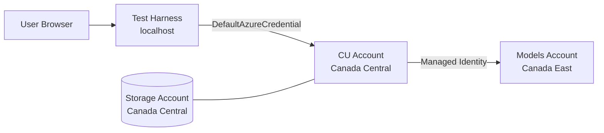

# Azure AI Content Understanding — FCT Canada

Extract structured data from commitment letters, title searches, and other documents using Azure AI Content Understanding. This repo contains everything needed to deploy the infrastructure and start testing — a Terraform configuration, a Blazor test harness with a visual UI, and a C# Polyglot Notebook for direct API exploration.

**What's included:**

| Component | What it does |
|-----------|-------------|
| [**Test Harness**](CU_TestHarness/README.md) | Blazor Server UI — upload documents, run analyzers, view extracted fields with confidence scores, compare CU vs Document Intelligence, run batch test suites with semantic matching |
| [**API Notebook**](CU_API_Testing/CU-API-Testing-Guide.ipynb) | C# Polyglot Notebook — walk through every CU REST API call interactively |
| **Infrastructure** (`deploy.tf`) | Single Terraform file — deploys both AI Services accounts, model deployments, storage, and RBAC |
| **Test Documents** (`test-docs/`) | Sample commitment letters and title search PDFs for testing |

## Architecture

Two AI Services accounts in separate Canadian regions enable Content Understanding (CU) to call GPT and embedding models via managed identity:



| Resource | Naming Convention | Region | Purpose |
|----------|-------------------|--------|---------|
| CU Account | `{prefix}-cusrv-models-{region}` | Canada Central | Content Understanding endpoint |
| Models Account | `{prefix}-cu-models-{region}` | Canada East | Hosts GPT + embedding deployments |
| Storage Account | `sa{prefix}cupoc` | Canada Central | Document blob storage |

### Model Deployments (on Models Account)

| Model | Deployment Name | SKU | Capacity (TPM) |
|-------|-----------------|-----|-----------------|
| gpt-4.1 | `gpt-41` | GlobalStandard | 100K |
| gpt-4.1-mini | `gpt-4.1-mini` | Standard | 100K |
| gpt-4o | `gpt-4o` | Standard | 100K |
| text-embedding-ada-002 | `text-embedding-ada-002` | Standard | 50K |
| text-embedding-3-large | `text-embedding-3-large` | Standard | 50K |
| text-embedding-3-small | `text-embedding-3-small` | Standard | 50K |

### Authentication

All access uses **Entra ID** (`DefaultAzureCredential`). API keys are disabled on the CU account (`local_auth_enabled = false`). The CU account's system-assigned managed identity has:

- `Cognitive Services User` on the Models account
- `Cognitive Services OpenAI User` on the Models account

Developers need `Cognitive Services User` role assigned on the CU resource to access the endpoint.

---

## Prerequisites

- [.NET 10 SDK](https://dotnet.microsoft.com/download)
- [VS Code](https://code.visualstudio.com/) with the [Polyglot Notebooks extension](https://marketplace.visualstudio.com/items?itemName=ms-dotnettools.dotnet-interactive-vscode)
- [Terraform CLI](https://developer.hashicorp.com/terraform/install) (>= 1.5)
- [Azure CLI](https://learn.microsoft.com/en-us/cli/azure/install-azure-cli) — authenticated via `az login`
- Contributor or Owner role on the target subscription/resource group

---

## Quick Start

### 1. Clone the repo

```powershell
git clone <REPO_URL>
cd Csharp_tf_entra_sentCx
```

### 2. Configure Terraform variables

```powershell
cp terraform.tfvars.example terraform.tfvars
# Edit terraform.tfvars — set prefix, resource group name, tags, etc.
```

### 3. Deploy infrastructure

```powershell
az login
terraform init
terraform plan -var-file="terraform.tfvars"
terraform apply -var-file="terraform.tfvars"
```

Terraform outputs the endpoints you need:
```
cu_endpoint            = "https://{prefix}-cusrv-models-cc.cognitiveservices.azure.com"
models_endpoint        = "https://{prefix}-cu-models-ce.cognitiveservices.azure.com"
models_connection_name = "{prefix}cumodelsce"
storage_account_name   = "sa{prefix}cupoc"
```

### 4. Assign RBAC for developers

Each developer who will use the CU endpoint or test harness needs:

```powershell
az role assignment create \
  --assignee "<USER_OR_GROUP_OBJECT_ID>" \
  --role "Cognitive Services User" \
  --scope "$(terraform output -raw cu_resource_id)"
```

### 5. Create CU connection to Models account

The CU account needs a registered connection to the Models account before it can route inference requests:

```powershell
$token = az account get-access-token --resource https://cognitiveservices.azure.com --query accessToken --output tsv
$cuEndpoint = terraform output -raw cu_endpoint
$modelsEndpoint = terraform output -raw models_endpoint
$modelsResourceId = terraform output -raw models_resource_id

$connectionBody = @{
    type = "azure_open_ai"
    name = "$(terraform output -raw models_connection_name)-connection"
    target = $modelsEndpoint
    credentials = @{ type = "aad" }
    metadata = @{
        ApiType = "Azure"
        ResourceId = $modelsResourceId
        Location = "canadaeast"
    }
} | ConvertTo-Json -Depth 10

Invoke-RestMethod `
  -Uri "$cuEndpoint/contentunderstanding/connections?api-version=2025-11-01" `
  -Method Put `
  -Headers @{ Authorization = "Bearer $token"; "Content-Type" = "application/json" } `
  -Body $connectionBody
```

### 6. Configure CU defaults

Register model deployments with the CU endpoint:

```powershell
Invoke-RestMethod `
  -Uri "$cuEndpoint/contentunderstanding/defaults?api-version=2025-11-01" `
  -Method Patch `
  -Headers @{ Authorization = "Bearer $token"; "Content-Type" = "application/json" } `
  -Body (Get-Content defaults-body.json -Raw)
```

### 7. Run the test harness

```powershell
cd CU_TestHarness
dotnet run
```

Open the URL shown in the terminal (typically `http://localhost:5000`). See [CU_TestHarness/README.md](CU_TestHarness/README.md) for feature details.

---

## CU Defaults Configuration

The `PATCH /contentunderstanding/defaults` API maps model names to specific deployments on your Models account. The connection name (models account name with hyphens stripped) is output by Terraform as `models_connection_name`.

`defaults-body.json` contains the model deployment mappings using the `fcttest` prefix. Update the connection name prefix if you used a different `prefix` in your `terraform.tfvars`.

After patching, verify with:
```powershell
Invoke-RestMethod -Uri "$cuEndpoint/contentunderstanding/defaults?api-version=2025-11-01" `
  -Method Get -Headers @{ Authorization = "Bearer $token" } | ConvertTo-Json -Depth 10
```

---

## Security Hardening (Production)

This POC deploys with public endpoints for ease of development. For production:

| Area | Recommendation |
|------|----------------|
| **Networking** | Enable Private Endpoints on CU, Models, and Storage accounts; disable public access |
| **Diagnostics** | Route diagnostic logs to a Log Analytics workspace |
| **RBAC** | Assign roles via Entra security groups instead of individual users |
| **Terraform State** | Store state in a secured Azure Storage backend with encryption |
| **Tags** | Enforce governance tags via Azure Policy |

---

## Cleanup

```powershell
terraform destroy -var-file="terraform.tfvars"
```

> **Note:** Deleted Cognitive Services accounts enter a 48-hour soft-delete state. To redeploy with the same name immediately, purge the soft-deleted account first:
> ```powershell
> az cognitiveservices account purge --name <ACCOUNT_NAME> --resource-group <RG_NAME> --location <LOCATION>
> ```

---

## Resources

- [Azure Content Understanding Overview](https://learn.microsoft.com/en-us/azure/ai-services/content-understanding/overview)
- [Content Understanding Studio](https://aka.ms/cu-studio)
- [REST API Reference](https://learn.microsoft.com/en-us/rest/api/contentunderstanding/operation-groups)
- [Cross-Resource Setup Guide](https://learn.microsoft.com/en-us/azure/ai-services/content-understanding/how-to/bring-your-own-cross-resource-capacity)
